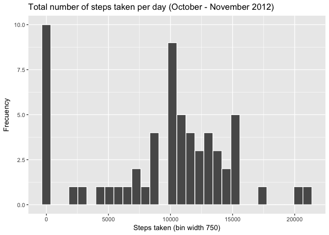
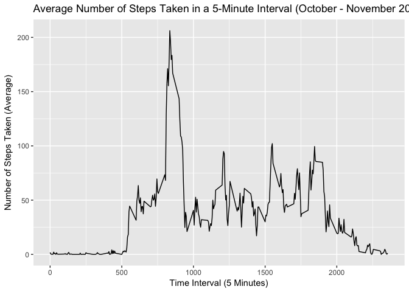
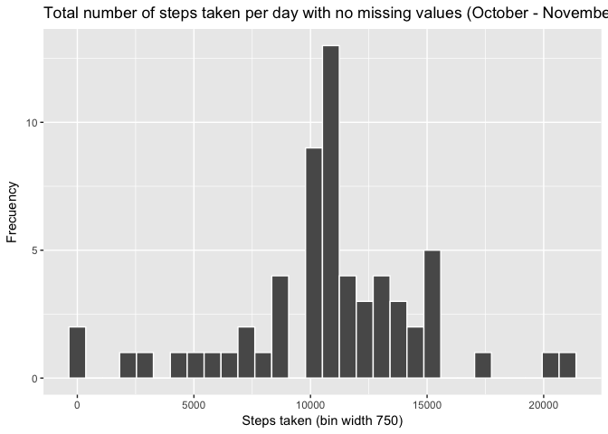
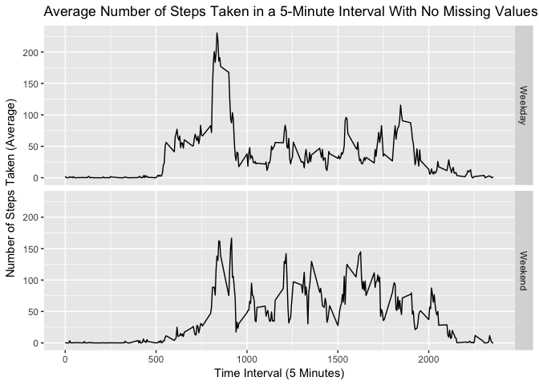

## Loading and preprocessing the data
1. Load the data

```r
# For this assignment I'll be downloading the dataset directly from the GitHub repository and check of if we had previously saved the dataset on the current directory. 

if(!file.exists("getdata-projectfiles-UCI HAR Dataset.zip")) {
  aux_file <- tempfile()
  download.file("http://d396qusza40orc.cloudfront.net/repdata%2Fdata%2Factivity.zip", aux_file)
  unzip(aux_file)
  unlink(aux_file)
  
  activity_data <- read.csv("activity.csv")
}
```

2. Process the data into a format suitable for analysis. 


```r
# Now, I'm going to take a look into the summary and the first five rows of the dataset to determine if we need to further data processing needs to be done.
summary(activity_data)
```

```
##      steps                date          interval     
##  Min.   :  0.00   2012-10-01:  288   Min.   :   0.0  
##  1st Qu.:  0.00   2012-10-02:  288   1st Qu.: 588.8  
##  Median :  0.00   2012-10-03:  288   Median :1177.5  
##  Mean   : 37.38   2012-10-04:  288   Mean   :1177.5  
##  3rd Qu.: 12.00   2012-10-05:  288   3rd Qu.:1766.2  
##  Max.   :806.00   2012-10-06:  288   Max.   :2355.0  
##  NA's   :2304     (Other)   :15840
```

```r
head(activity_data)
```

```
##   steps       date interval
## 1    NA 2012-10-01        0
## 2    NA 2012-10-01        5
## 3    NA 2012-10-01       10
## 4    NA 2012-10-01       15
## 5    NA 2012-10-01       20
## 6    NA 2012-10-01       25
```


```r
# After reviewing the summary and head function's outcome, I don't think we'll be needing to process the data. 
```

----


## What is mean total number of steps taken per day?
1. Total number of steps taken per day

```r
# For this section, I've been instructed to ignore the missing values, so I'll be setting to TRUE the na.rm function. 

total_steps_per_day <- tapply(activity_data$steps, activity_data$date, FUN = sum, na.rm = TRUE)

head(total_steps_per_day)
```

```
## 2012-10-01 2012-10-02 2012-10-03 2012-10-04 2012-10-05 2012-10-06 
##          0        126      11352      12116      13294      15420
```

2. Histogram of the total number of steps taken per day

```r
# For this assignment I'll be using the ggplot2 plotting system. 
# Let's start by loading the corresponding library
library(ggplot2)

# For calculating the bin width, I've done the following calculations: 
# 1. Cubic root of the 17,568 observations we have = 25.9960
# 2. Do the inverse of 25.9960 = 0.0384
# 3. Mutiply 0.0384 by the standard deviation (5405.895) = 207.9506
# 3. Multiply 207.9506 by the constant derived from statistical theory (3.49) = 725.748
qplot(total_steps_per_day,  geom = "histogram", binwidth = 725, main = "Total number of steps taken per day (October - November 2012)", xlab = "Steps taken (bin width 750)", ylab = "Frecuency", col=I("white"))
```

<!-- -->

3. Mean and median of the total number of steps taken per day

```r
mean(total_steps_per_day, na.rm = TRUE)
```

```
## [1] 9354.23
```


```r
median(total_steps_per_day, na.rm = TRUE)
```

```
## [1] 10395
```


----


## What is the average daily activity pattern?
1. Time series plot of the 5-minute interval and the average number of steps taken, averaged across all days

```r
# Calculating the average number of steps per time block 

average_number_steps <- aggregate(x = list(steps = activity_data$steps), by = list(interval = activity_data$interval), FUN = mean, na.rm = TRUE)

head(average_number_steps)
```

```
##   interval     steps
## 1        0 1.7169811
## 2        5 0.3396226
## 3       10 0.1320755
## 4       15 0.1509434
## 5       20 0.0754717
## 6       25 2.0943396
```


```r
ggplot(data = average_number_steps, aes(x = interval, y = steps)) +
      geom_line() +
      xlab("Time Interval (5 Minutes)") + 
      ylab("Number of Steps Taken (Average)") + 
      ggtitle("Average Number of Steps Taken in a 5-Minute Interval (October - November 2012)")
```

<!-- -->

2. Which 5-minute interval, on average across all the days in the dataset, contains the maximum number of steps?

```r
average_number_steps[which.max(average_number_steps$steps),]
```

```
##     interval    steps
## 104      835 206.1698
```


----


## Imputing missing values
1. Total number of missing values in the dataset

```r
# Calculating the total number of rows with NA
# Rows with missing steps data
length(which(is.na(activity_data$steps)))
```

```
## [1] 2304
```

```r
# Rows with missing interval data
length(which(is.na(activity_data$interval)))
```

```
## [1] 0
```

```r
# Rows with missing steps date data
length(which(is.na(activity_data$date)))
```

```
## [1] 0
```

```r
# The total number of rows with NA is 2304
```

2. Strategy for filling in all of the missing values in the dataset

```r
# For this assignment, I'll be using the mean for the 5-minute interval to replace all of the missing values in the dataset.
```

3. Dataset with non-missing values

```r
# First, I'll create a copy of the dataset
activity_data_filled <- activity_data

# Then, I'll replace all of the NAs with the average value by using the mean function
activity_data_filled <- transform(activity_data, steps = ifelse(is.na(activity_data$steps), average_number_steps$steps[match(activity_data$interval, average_number_steps$interval)], activity_data$steps))

# Let's take a look to the first five rows to see how the data looks like
head(activity_data_filled)
```

```
##       steps       date interval
## 1 1.7169811 2012-10-01        0
## 2 0.3396226 2012-10-01        5
## 3 0.1320755 2012-10-01       10
## 4 0.1509434 2012-10-01       15
## 5 0.0754717 2012-10-01       20
## 6 2.0943396 2012-10-01       25
```

```r
# To the summary.. 
summary(activity_data_filled)
```

```
##      steps                date          interval     
##  Min.   :  0.00   2012-10-01:  288   Min.   :   0.0  
##  1st Qu.:  0.00   2012-10-02:  288   1st Qu.: 588.8  
##  Median :  0.00   2012-10-03:  288   Median :1177.5  
##  Mean   : 37.38   2012-10-04:  288   Mean   :1177.5  
##  3rd Qu.: 27.00   2012-10-05:  288   3rd Qu.:1766.2  
##  Max.   :806.00   2012-10-06:  288   Max.   :2355.0  
##                   (Other)   :15840
```

```r
# And finally let's make a double check that there are no more missing values
length(which(is.na(activity_data_filled$steps)))
```

```
## [1] 0
```

4. Histogram of the total number of steps taken each day

```r
# First, I need to calculate the total number of steps of the new dataset
total_steps_per_day_filled <- tapply(activity_data_filled$steps, activity_data_filled$date, FUN = sum)

# Now that we have the total steps, I'm going to do the histogram
qplot(total_steps_per_day_filled,  geom = "histogram", binwidth = 725, main = "Total number of steps taken per day with no missing values (October - November 2012)", xlab = "Steps taken (bin width 750)", ylab = "Frecuency", col=I("white"))
```

<!-- -->

```r
# I'm also asked to calculate the mean and median
mean(total_steps_per_day_filled, na.rm = TRUE)
```

```
## [1] 10766.19
```

```r
median(total_steps_per_day_filled, na.rm = TRUE)
```

```
## [1] 10766.19
```


```r
# Question: Do these values differ from the estimates from the first part of the assignment? 

# Answer: Yes, the new values differ from the estimates from the first part of the assignment. 


# Question: What is the impact of imputing missing data on the estimates of the total daily number of steps?

# Answer: The impact of imputing missing data on the estimates of the total daily number of steps is that the mean and median values are higher. The reason is that in the original datasets, all of the missing values are set to 0 by defalut, and in the new dataset, these 0s are replaced with the average steps of the given interval. 
```


----


## Are there differences in activity patterns between weekdays and weekends?
1. Two-level varaible 

```r
# For this section, I was instructed to use the dataset with the imputed values

activity_data_filled$DateType <- ifelse(weekdays(as.Date(activity_data_filled$date)) %in% c("Monday", "Tuesday", "Wednesday", "Thursday", "Friday"), "Weekday", "Weekend")
```

```
## Warning in strptime(xx, f <- "%Y-%m-%d", tz = "GMT"): unknown timezone
## 'zone/tz/2018c.1.0/zoneinfo/America/Monterrey'
```

```r
# Let's verify that the output is correct
head(activity_data_filled)
```

```
##       steps       date interval DateType
## 1 1.7169811 2012-10-01        0  Weekday
## 2 0.3396226 2012-10-01        5  Weekday
## 3 0.1320755 2012-10-01       10  Weekday
## 4 0.1509434 2012-10-01       15  Weekday
## 5 0.0754717 2012-10-01       20  Weekday
## 6 2.0943396 2012-10-01       25  Weekday
```

2. Panel time series plot of the 5-minute interval and the average number of steps taken, averaged across all weekday days or weekend days

```r
# Calculating the average number of steps per time block with the new data

average_number_steps_filled <- aggregate(steps ~ interval + DateType, data = activity_data_filled, FUN = mean)

head(average_number_steps_filled)
```

```
##   interval DateType      steps
## 1        0  Weekday 2.25115304
## 2        5  Weekday 0.44528302
## 3       10  Weekday 0.17316562
## 4       15  Weekday 0.19790356
## 5       20  Weekday 0.09895178
## 6       25  Weekday 1.59035639
```


```r
ggplot(data = average_number_steps_filled, aes(x = interval, y = steps)) +
      geom_line() +
      facet_grid(DateType ~ .) + 
      xlab("Time Interval (5 Minutes)") + 
      ylab("Number of Steps Taken (Average)") + 
      ggtitle("Average Number of Steps Taken in a 5-Minute Interval With No Missing Values (October - November 2012)")
```

<!-- -->

